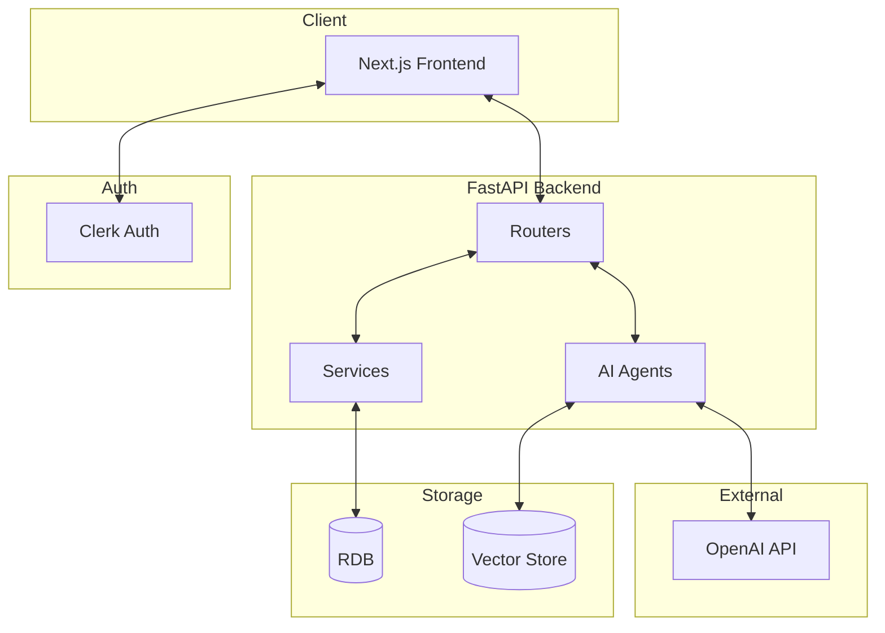
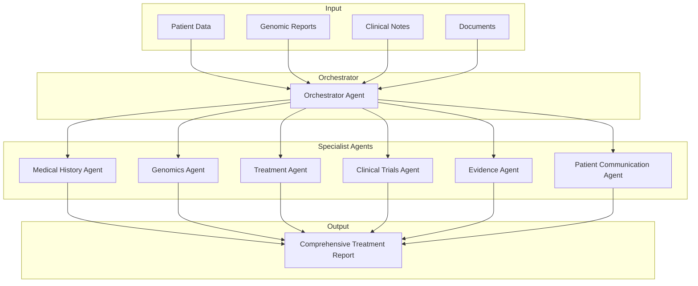
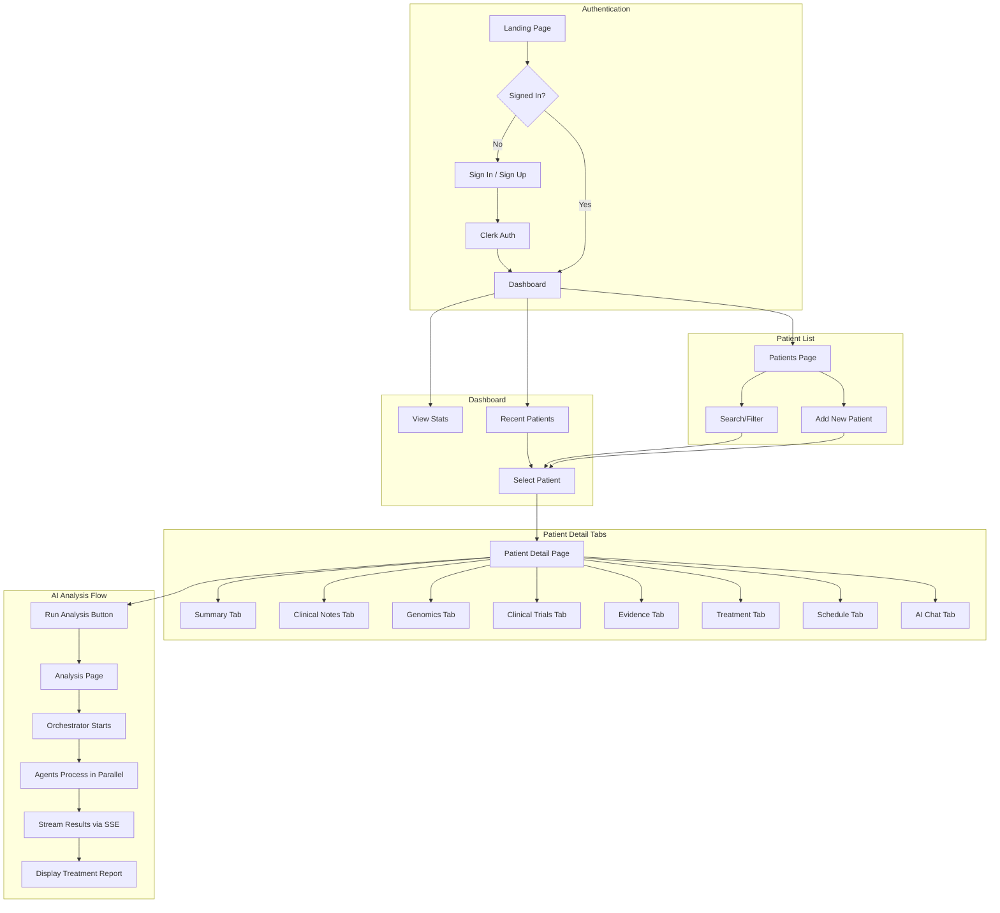
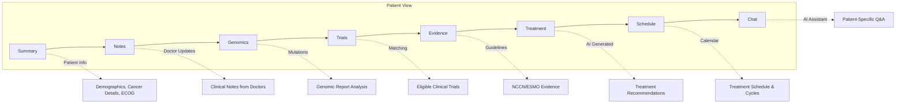
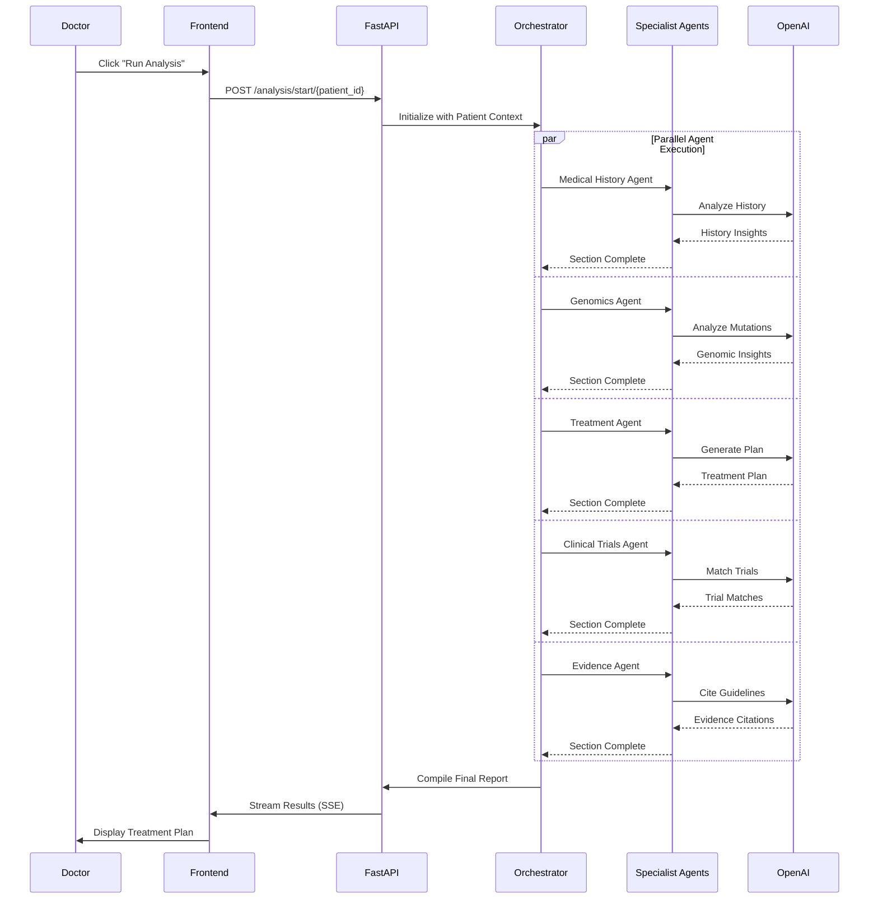

# Cancer Care Coordinator - System Design

## Overview

An AI-powered clinical decision support system for oncologists. It analyzes patient data, genomic reports, and clinical notes to generate personalized treatment recommendations using multi-agent AI architecture.

## Core Features

| Feature | Description |
|---------|-------------|
| **Patient Management** | CRUD operations with cancer staging, comorbidities, ECOG status |
| **AI Analysis** | Multi-agent system generates treatment plans from patient data |
| **Clinical Notes** | Doctor updates that feed into AI context for better recommendations |
| **Document Processing** | PDF/genomic report parsing and analysis |
| **AI Chat** | Contextual Q&A about specific patients |

## Tech Stack

```
Frontend:  Next.js + TypeScript + TailwindCSS + React Query
Backend:   FastAPI + SQLAlchemy + aiosqlite
AI:        OpenAI GPT-4 + LangChain + Multi-Agent Orchestration
Auth:      Clerk
```

---

## Architecture Diagram



---

## Multi-Agent Architecture



### Agent Responsibilities

| Agent | Role |
|-------|------|
| **Orchestrator** | Coordinates all agents, merges outputs into final report |
| **Medical History** | Analyzes patient history, comorbidities, ECOG status |
| **Genomics** | Interprets mutations, biomarkers, targeted therapy options |
| **Treatment** | Recommends chemotherapy regimens, dosing, scheduling |
| **Clinical Trials** | Matches patient to eligible ongoing trials |
| **Evidence** | Cites guidelines (NCCN, ESMO) and recent publications |
| **Patient Communication** | Generates patient-friendly explanations |

---

## User Flow



---

## Patient Detail Tabs



---

## Data Flow



---

## Key Design Decisions

1. **Multi-Agent over Monolithic LLM** - Specialized agents produce more accurate domain-specific outputs
2. **SSE for Analysis** - Real-time streaming shows progress during long-running AI tasks
3. **Clinical Notes Integration** - Doctor observations directly influence AI recommendations
4. **Tab-Based Patient View** - Organized access to different aspects of patient care
5. **React Query** - Automatic caching, polling, and state management for API data
